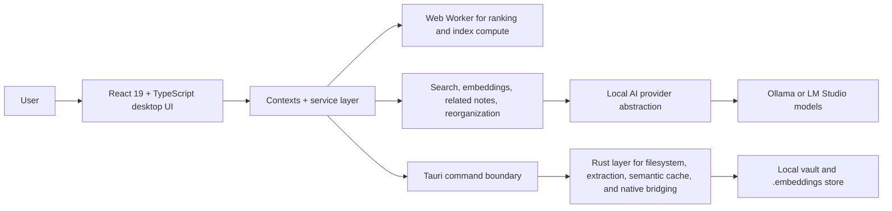

# Pipnote

Pipnote is a local-first AI knowledge workspace for turning a messy folder of notes into a private, searchable, grounded knowledge base that runs on your own machine.

I built it as a serious product and engineering exercise at the intersection of modern AI, React + TypeScript frontend architecture, and Rust-powered desktop infrastructure. This is not a thin wrapper around a model API. It is an end-to-end system for vault ingestion, document extraction, embeddings lifecycle, hybrid retrieval, grounded Q&A, related-note discovery, AI-assisted reorganization, and reviewable execution.

## What This Repository Demonstrates

- Product judgment: AI features are grounded, reviewable, and designed to earn user trust instead of hiding behind magic.
- Modern AI systems thinking: provider abstraction, model capability validation, embeddings maintenance, hybrid retrieval, provenance labeling, and graceful fallback behavior.
- React + TypeScript frontend depth: multi-panel desktop UX, lazy-loaded surfaces, worker-backed ranking, resilient onboarding, and state separated into focused services and contexts.
- Rust used as real infrastructure: native filesystem access, document extraction, semantic cache management, local provider bridge, path-safe embedding storage, and faster desktop-side operations.
- Reliability discipline: soft-delete flows, undo logs, vault consistency repair, performance diagnostics, release checks, and a broad automated test surface.

## Why I Built It

Most AI note apps are strong at generating text but weak at the harder product problems:

- making answers feel trustworthy
- keeping data local
- handling messy real-world files
- helping users reorganize safely
- staying responsive while indexing and searching a growing vault

Pipnote is my answer to that gap. The goal is a desktop knowledge tool that feels practical, privacy-respecting, and engineered for real use rather than demo-day theatrics.

## Core Capabilities

- Local vault workspace with folder tree, tabs, autosave, markdown edit/preview/split modes, backlinks, outline, favorites, and recent notes.
- Grounded Q&A over local notes and AI-readable documents with source snippets, provenance labels, and fallback handling when grounding is weak.
- Embeddings generation, stale/missing index repair, related-note discovery, and hybrid search across semantic and keyword signals.
- AI-assisted vault reorganization with suggestion levels, duplicate detection, review flows, soft delete, and undo logs.
- Preview and AI-readable handling for multiple document types including Markdown, text, PDF, DOCX, PPTX, XLSX, and CSV where extraction is available.
- Performance and reliability tooling including Rust-side semantic cache, worker-based ranking, adaptive embedding queue scheduling, consistency repair, and diagnostics.

## Architecture Snapshot



See the deeper design in [docs/ARCHITECTURE.md](./docs/ARCHITECTURE.md).

## Technical Highlights

### React + TypeScript Frontend

- Built as a desktop-grade React application instead of a toy chat shell.
- Uses focused services and contexts for editor state, tabs, settings, theme, and toast flows.
- Keeps heavier semantic ranking off the main thread with a dedicated worker and inline fallback path.
- Uses lazy loading for larger panels so the app stays responsive as features grow.

### AI System Design

- Supports multiple local runtimes through a narrow provider interface instead of hard-coding one model stack.
- Separates text-generation and embedding capabilities, validates model compatibility, and blocks unsafe actions when provider health is bad.
- Blends semantic retrieval, keyword search, reranking, heuristics, and provenance labeling so answers are not just "AI output" but explainable product behavior.
- Treats destructive AI as a review problem, not an autonomy problem: reorganize suggestions are inspectable, soft-deleted, and undoable.

### Rust as AI Infrastructure

- Rust is not only packaging glue here; it owns native boundaries that matter.
- Tauri commands handle filesystem traversal, preview and extraction paths, semantic cache construction, embedding storage, rename/delete consistency, and local provider requests.
- This split keeps UX iteration fast in TypeScript while placing native and performance-sensitive work closer to the desktop boundary.

### Quality and Release Discipline

- 36 test files cover core editor logic, retrieval ranking, explainability, grounding, reorganization rules, heuristics, caching, and indexing utilities.
- Playwright smoke coverage exists for end-to-end validation.
- `scripts/release-check.sh` runs editor and logic tests, frontend build, and `cargo check` before release packaging.

## Design Principles

- Local-first before cloud-first.
- Grounded answers before flashy answers.
- Reviewable AI actions before silent automation.
- Performance-aware UX instead of background work that fights the editor.
- Clear system boundaries over framework magic.

## Current Limits

- Image OCR and image-grounded retrieval are not implemented yet.
- Answer quality still depends on local model quality and extracted document text quality.
- The product has meaningful automated coverage, but deeper end-to-end regression coverage is still a growth area.

## Tech Stack

- Frontend: React 19, TypeScript, Vite, Tailwind CSS
- Desktop shell: Tauri v2
- Native layer: Rust
- Local AI runtimes: Ollama or LM Studio
- Testing: Node test runner + Playwright

## Run Locally

### Prerequisites

- Node.js 20+
- `pnpm` 9+
- Rust stable
- Tauri system dependencies for your OS
- One local AI runtime: Ollama or LM Studio

### Setup

```bash
pnpm install
pnpm tauri:dev
```

If you only want the web UI:

```bash
pnpm dev
```

Useful checks:

```bash
pnpm lint
pnpm test:editor
pnpm release:check
```

## Project Structure

- `src/`: React application, UI components, contexts, services, workers, and domain utilities
- `src-tauri/`: Rust commands, native filesystem bridge, semantic cache, and local AI request handling
- `tests/`: unit tests for retrieval, heuristics, reorganization, editor behavior, and supporting utilities
- `docs/`: architectural notes and supporting design documentation

## What I Want This Repo To Signal

If you are evaluating my work through this repository, the signal is intentional: I like building AI products that are useful in the real world, not just impressive in a demo. That means strong product taste, honest grounding, careful system boundaries, fast interfaces, and enough infrastructure discipline to make the experience trustworthy.

Pipnote reflects how I think about modern AI software: the model matters, but retrieval quality, UX, performance, safety, and operational clarity matter just as much.
