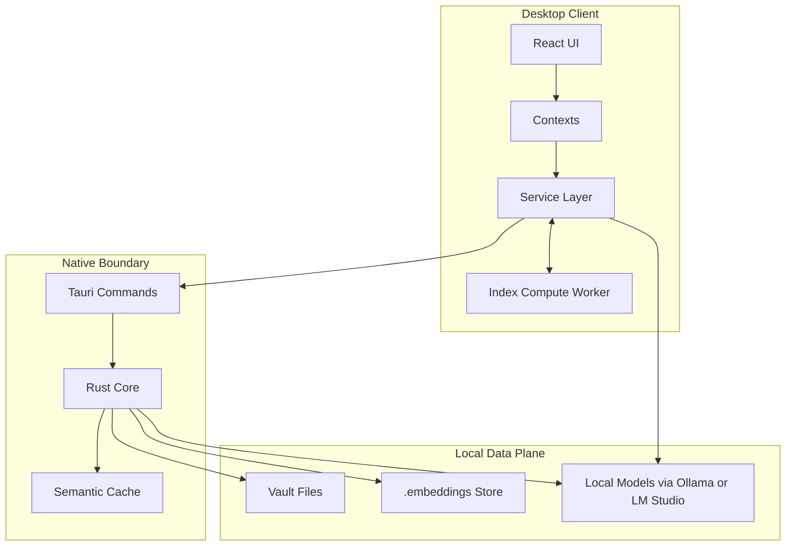
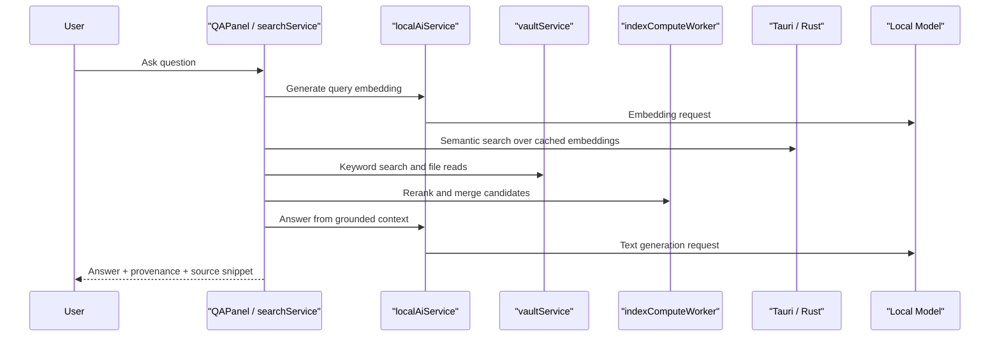
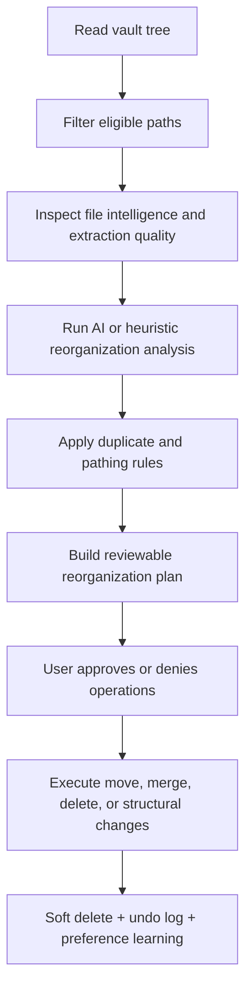

# Pipnote Architecture

## Executive Summary

Pipnote is a local-first desktop AI knowledge workspace built around a deliberate split:

- React + TypeScript for product velocity and interaction design
- a client-side service layer for orchestration and feature logic
- a Web Worker for heavier ranking and index-compute tasks
- Tauri + Rust for native filesystem access, document extraction, semantic cache management, and local AI bridging
- Ollama or LM Studio as pluggable local runtimes for text generation and embeddings

This architecture keeps iteration fast in the product layer while placing native and performance-sensitive concerns close to the desktop boundary.

## Design Goals

- Keep user data local and avoid unnecessary cloud dependencies.
- Make AI answers grounded and inspectable instead of opaque.
- Keep destructive AI actions reviewable, reversible, and operationally safe.
- Preserve editor responsiveness while background indexing and retrieval work continues.
- Separate product iteration concerns from native and infrastructure concerns.

## System Overview

## Layer Responsibilities

| Layer | Representative modules | Responsibilities |
| --- | --- | --- |
| UI shell | `src/App.tsx`, `src/components/` | Desktop interaction model, panels, tabs, onboarding, editor surfaces, and user-facing workflows |
| State and orchestration | `src/contexts/`, `src/services/search.ts`, `src/services/localAi.ts`, `src/services/reorganize.ts` | Coordinates retrieval, AI actions, settings, health checks, background queues, and user-safe execution |
| Background compute | `src/services/indexComputeWorker.ts`, `src/workers/indexComputeWorker.ts` | Offloads ranking and index-compute work off the main thread, with inline fallback if the worker is unavailable |
| Native boundary | `src-tauri/src/lib.rs` | Filesystem traversal, previews, extraction, semantic cache management, embedding persistence, and local AI requests |
| Local AI runtimes | Ollama, LM Studio | Text generation and embeddings, selected by provider abstraction rather than hard-coded integration |

## Request Flow: Grounded Q&A

### Notes on this flow

- The retrieval path is hybrid, not purely semantic. Keyword matches and semantic matches are merged, reranked, and explained.
- Answers are intentionally labeled with provenance and confidence rather than presented as absolute truth.
- When grounding is weak, the system can fall back to a general answer mode, but that mode is explicitly signaled.

## Request Flow: AI-Assisted Reorganization

### Why this matters

- Reorganization is treated as an approval workflow, not an uncontrolled autonomous agent.
- The system uses heuristics and file intelligence to stay conservative when extraction quality is weak or a file is visually oriented.
- Destructive operations can be soft-deleted and logged to `.vn-system/reorg-undo`.

## Reliability and Performance Patterns

- Provider health validation: model availability and capability checks happen before AI-dependent operations run.
- Graceful fallback: worker failures fall back to main-thread compute; weak grounding falls back to clearly labeled general answers.
- Native semantic cache: Rust builds and invalidates a cache of embeddings and chunk excerpts to avoid repeated cold scans.
- Adaptive embedding queue: background embedding work adapts concurrency and batch size based on typing pressure and backlog size.
- TTL caching in the client: tree reads, file content, AI-readable content, keyword search, and embedding lists are cached for responsive UX.
- Path-safe persistence: rename and delete operations update embedding storage and invalidate caches to keep the vault consistent.
- Reviewability: reorganization suggestions are surfaced with levels, review context, and undo support.

## Key Architectural Decisions

### 1. Rust handles the desktop boundary

Rust is responsible for work that benefits from native execution and direct filesystem control:

- walking the vault
- reading previews and AI-readable content
- persisting embeddings
- building semantic cache structures
- bridging local AI HTTP calls through Tauri commands

This lets the TypeScript layer stay focused on product logic rather than low-level desktop concerns.

### 2. TypeScript keeps orchestration flexible

The search, grounding, reorganization, and queue logic stays in TypeScript because this layer changes quickly during product iteration. It is easier to tune heuristics, prompts, ranking strategies, and UX behavior here than inside the native layer.

### 3. Provider abstraction stays intentionally narrow

The provider layer focuses on the minimum useful contract:

- list models
- generate text
- generate embeddings

That keeps Ollama and LM Studio swappable without leaking provider-specific complexity through the rest of the app.

### 4. Review beats hidden automation

Potentially destructive AI operations are intentionally exposed as plans the user can inspect, approve, or deny. This is a product decision as much as a technical one.

## Tradeoffs

- Local-first architecture improves privacy and ownership, but answer quality and latency depend on the user's local model setup.
- File-based embedding storage is easy to inspect and portable, but may eventually want a more specialized index as vault size grows.
- Keeping orchestration in TypeScript improves iteration speed, but some hot paths may be worth moving deeper into Rust over time.
- Supporting multiple runtimes increases resilience and user choice, but adds more compatibility and capability validation logic.

## What I Would Likely Evolve Next

- persistent vector indexing beyond the current cache strategy for larger vaults
- OCR and image-grounded retrieval for visually rich notes
- stronger background job persistence and resume behavior
- deeper end-to-end regression coverage for complex vault workflows
- richer profiling around retrieval quality, latency, and queue behavior

## Summary

Pipnote is designed as a practical AI product, not just an AI demo. The architecture reflects a clear point of view:

- React + TypeScript for fast product iteration
- Rust for native boundaries and infrastructure-heavy work
- local models for privacy and control
- grounded, reviewable AI flows for trust

That combination is the core of the system and the main reason this repository is a strong signal of modern AI product engineering ability.
